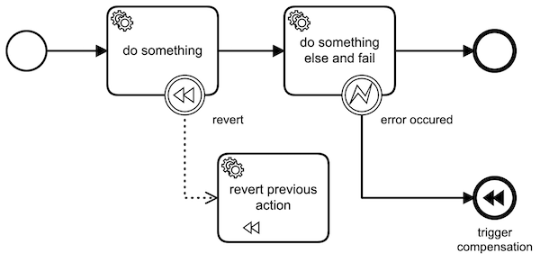

## BPMN Compensation
Sometimes it is necessary to rollback any executed task in case of an error. Think about a process where a credit card
or a bank account is used but the process fails in a later state and the customner should get his money back (or the hotel 
reservation should be cancelled etc). The process should be able to compensate the error.

## Example

## Execution
- start the application by running `./gradlew compensation:bootRun'`
- go to `localhost:8080` and login as `admin:admin`
- start a task from the task list and check the log output
- if you have an enterprise licence you can also check the task history in the cockpit app
