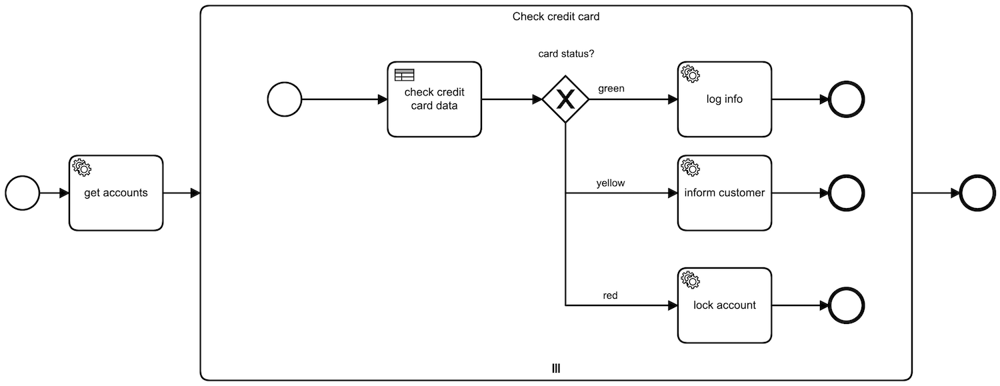

## Credit Card Updater
BPMN offers the possibility to run multiple tasks in parallel, iterating over a list of objects

## Scenario
This process iterates over a huge list of customer credit cards and checks if they are expired to either inform the customer 
to update it or lock the account

The respectiv dmn table returns a status red, yellow or green based on the expiration days:

- green: 60+ days left
- yellow: between 0 and 60 days left
- red: expired (negative days)

## Execution
- start the application by running `./gradlew credit-card-updater:bootRun'`
- go to `localhost:8080` and login as `admin:admin`
- start a task from the task list and check the log output
- if you have an enterprise licence you can also check the task history in the cockpit app
