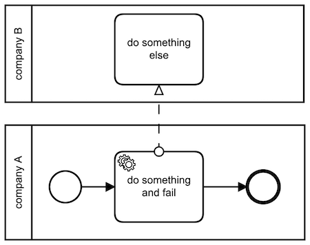
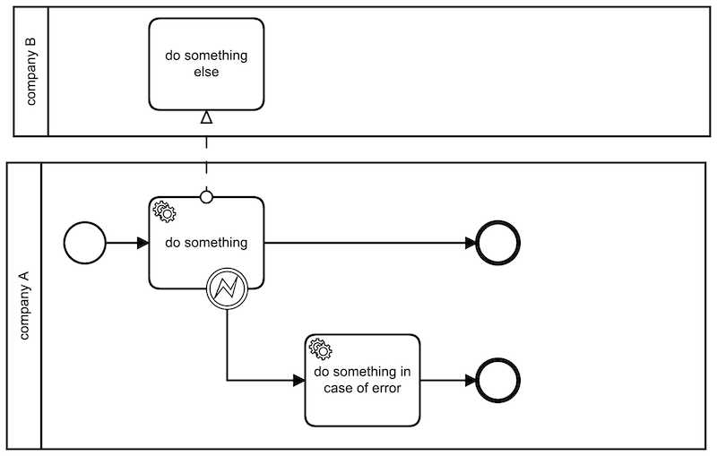

## BPMN Error Handling
Camunda BPM implements several ways to handle errors

- technical errors (unexpected)
- business errors (expected)

### Business errors
They are expected to happen during and are considered in the process by using intermediate error
events, error start events or error end events

### Technical errors
They are not modeled into the bpmn model and are therefor considered as unexpected. Those errors are normally of a more 
technical nature but can also be business errors which were not considered during the creation of the model

## Process models
- Error Sync - the execution is synchronous and the engine uses the same thread for the execution. Errors result in a failing process start
- Error Async - the execution is asynchronous. The process is started and the execution is given to the job executor. Erros result in Incidents
- Error BE - the process model has an error path to handle expected errors

## Example
Sync and async do not differ in the model. The async execution is reached by setting the `asyncBefore` option in the modeller for the `do something and fail` activity

Example with an error catch event

## Execution
- start the application by running `./gradlew error-handler:bootRun'`
- go to `localhost:8080` and login as `admin:admin`
- start a task from the task list and check the log output
- if you have an enterprise licence you can also check the task history in the cockpit app
